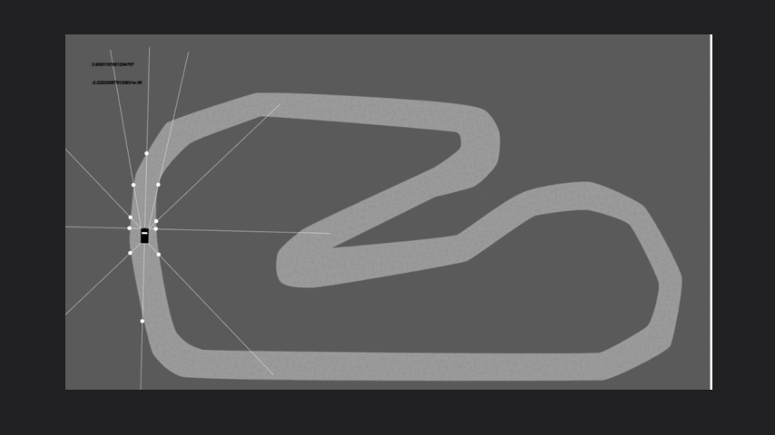
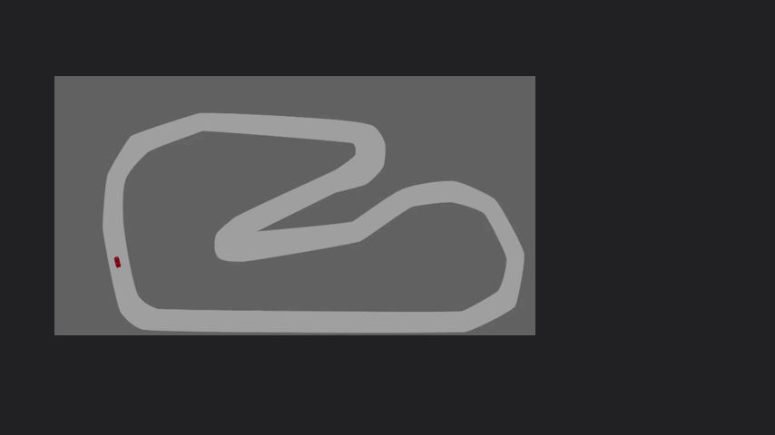
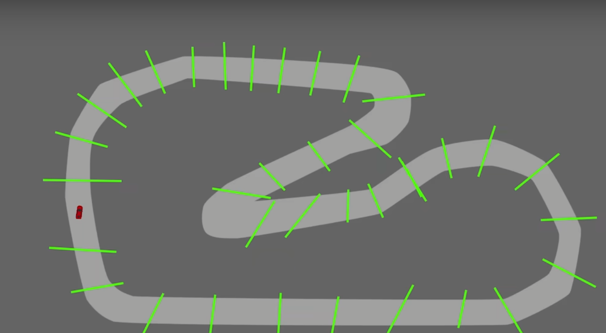
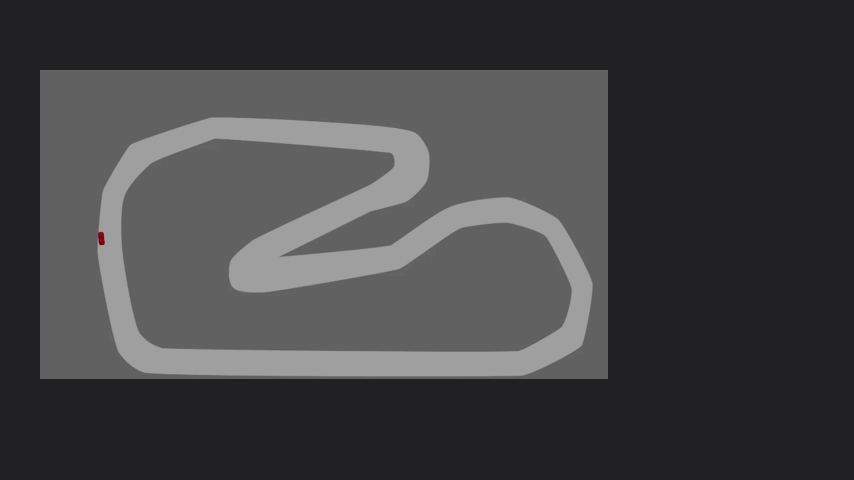
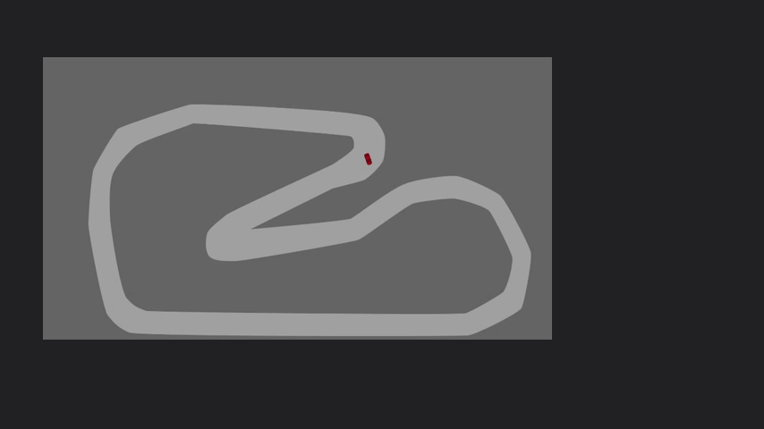
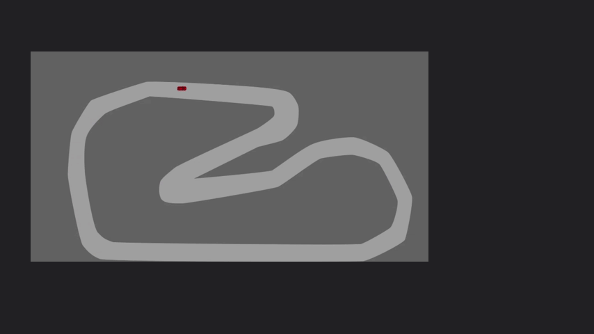

AI RACER started as a simple 2D racing game built in the Pygame framework.
Reinforcment Learning via the PyTorch framework, was added to the game to allow a player to test, tune, train, and play with a Deep Q Learning Network.
The goal here is to show the ia, and thee racing game.

global system :
AI rewarded if it does a lap  
Resets if it goes off road.  
  
The AI ​​perceives its environment using lines indicating the distance between its position and the edge of the road  
 

If the AI ​​is rewarded for each lap completed, it will try to cross the finish line in a loop, without going around...  
 

I set up “reward gates” to nudge the AI ​​to do the trick.  

Evolution after few tries   

Evolution after 800 + after 1000 tries  
 

Evolution after a night of training, we notice that she does not stop doing laps, but seeks to optimize her trajectories to go as quickly as possible.  
 

